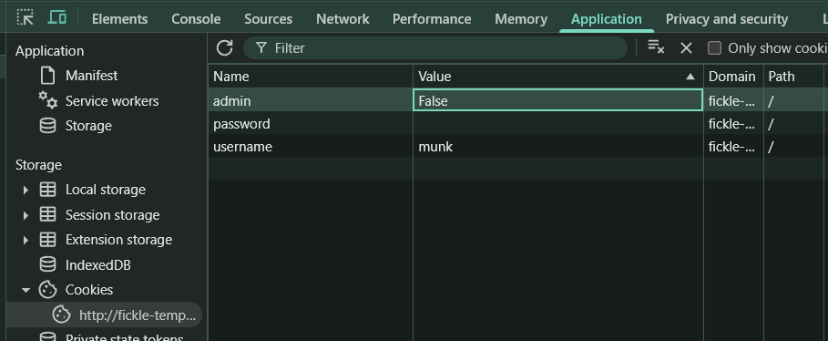
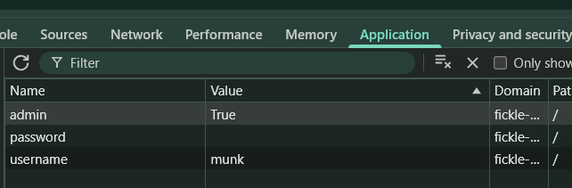
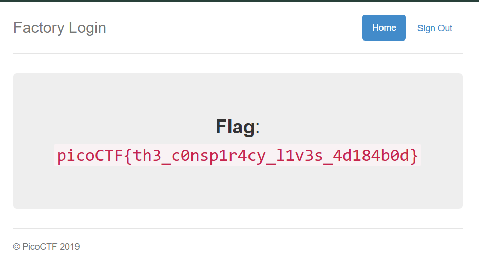

# logon

- **Kategori:** Web Exploitation
- **Tingkat Kesulitan:** Easy
- **Platform:** picoCTF 2019

## Deskripsi
The factory is hiding things from all of its users. Can you login as Joe and find what they've been looking at?

Link: `http://fickle-tempest.picoctf.net:58573`

**Hint:** Hmm it doesn't seem to check anyone's password, except for Joe's?

## Solusi

1. **Analisis Awal**
   Berdasarkan petunjuk dari soal, sistem sepertinya tidak memvalidasi kata sandi selain untuk pengguna bernama "Joe". Jika kita mencoba login dengan nama pengguna sembarang, sistem akan tetap mengizinkan kita masuk.

2. **Pemeriksaan Cookies (Client-Side Storage)**
   Setelah berhasil login menggunakan nama pengguna acak (misalnya "munk"), kita tidak langsung melihat *flag*. Untuk mencari tahu bagaimana sistem melacak status pengguna kita, kita bisa membuka **Developer Tools** di *browser* dan berpindah ke tab **Application** (atau **Storage** di beberapa *browser*) lalu melihat bagian **Cookies**.
   
   Di sana, terdapat cookie bernama `admin` yang nilainya diatur menjadi `False`.

   

3. **Manipulasi Cookie**
   Karena aplikasi web ini mengandalkan *cookie* di sisi klien untuk memvalidasi apakah pengguna tersebut adalah *admin* atau bukan, kita bisa memanipulasinya secara langsung. Ubah *value* dari cookie `admin` tersebut dari `False` menjadi `True`.

   

4. **Menemukan Flag**
   Setelah mengubah nilai *cookie* menjadi `True`, muat ulang (*refresh*) halaman web tersebut. Server sekarang menganggap sesi kita memiliki hak akses *admin* dan akan langsung menampilkan *flag* di layar.

   

## Flag
`picoCTF{th3_c0nsp1r4cy_l1v3s_4d184b0d}`

