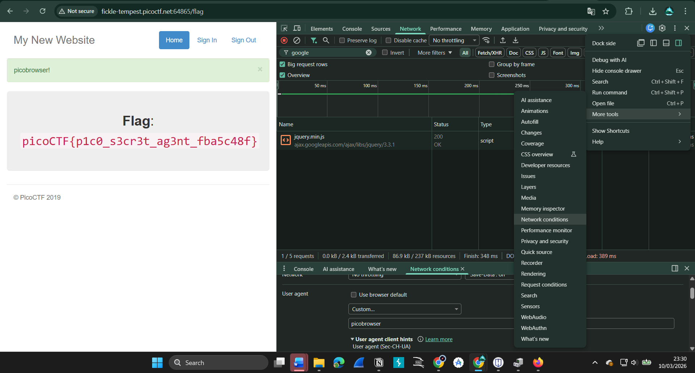

# picobrowser

- **Kategori:** Web Exploitation
- **Tingkat Kesulitan:** Medium
- **Platform:** picoCTF 2019

## Deskripsi
This website can be rendered only by picobrowser, go and catch the flag!
Link: `http://fickle-tempest.picoctf.net:64865`

**Hint:** You don't need to download a new web browser

## Solusi

1. **Analisis Petunjuk**
   Deskripsi soal menyatakan bahwa situs ini hanya bisa dirender oleh "picobrowser". Namun, petunjuknya menegaskan bahwa kita tidak perlu mengunduh *browser* web yang baru. Ini adalah petunjuk utama untuk melakukan teknik manipulasi *header* HTTP, khususnya **User-Agent Spoofing**.

2. **Memanipulasi User-Agent**
   Setiap kali kita mengakses halaman web, *browser* mengirimkan informasi identitasnya melalui *header* `User-Agent`. Kita bisa memalsukan identitas ini menggunakan fitur bawaan *Developer Tools*.
   
   Langkah-langkahnya:
   - Buka **Developer Tools** (*Inspect Element*).
   - Klik menu titik tiga di pojok kanan atas jendela *Developer Tools*, lalu navigasikan ke **More tools** > **Network conditions**.
   - Pada panel *Network conditions* yang muncul di bawah, hilangkan centang pada opsi **Use browser default** di bagian *User agent*.
   - Ubah *dropdown* menjadi **Custom...** dan ketikkan secara manual: `picobrowser`.

   

3. **Menemukan Flag**
   Setelah `User-Agent` berhasil diubah menjadi `picobrowser`, muat ulang (*refresh*) halaman web tersebut. Server kini mengidentifikasi permintaan kita seolah-olah berasal dari "picobrowser" yang sah dan langsung menampilkan *flag* di layar.

## Flag
`picoCTF{p1c0_s3cr3t_ag3nt_fba5c48f}`
